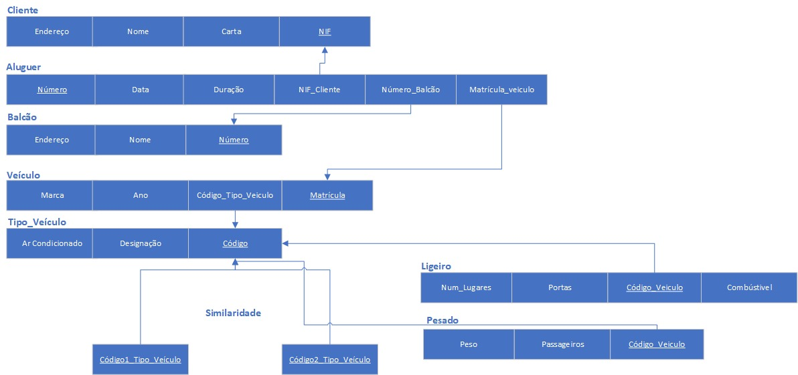
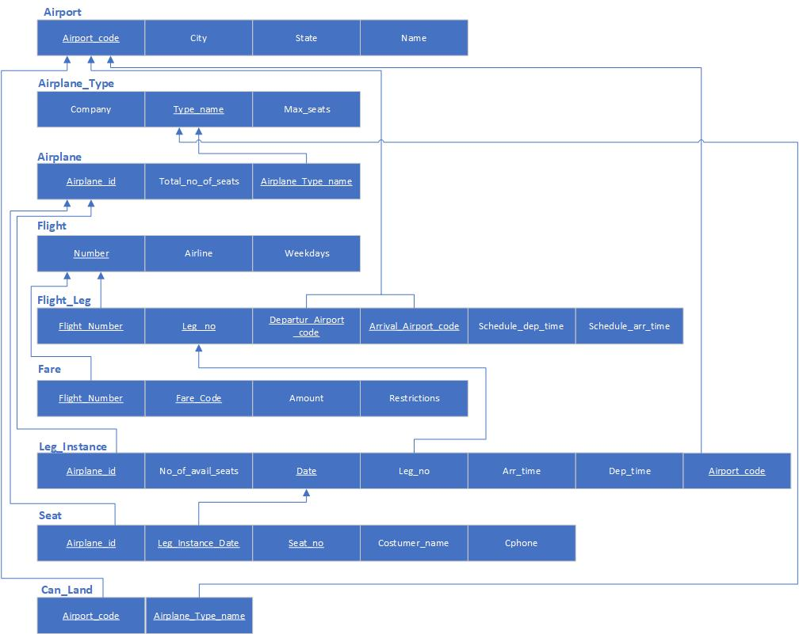
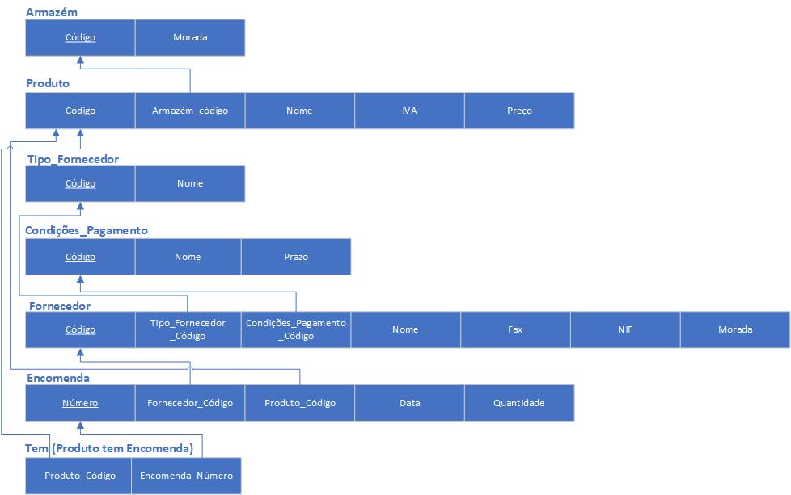
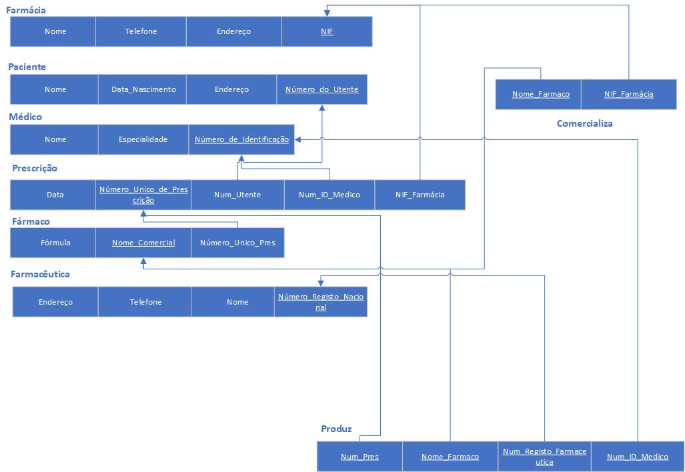
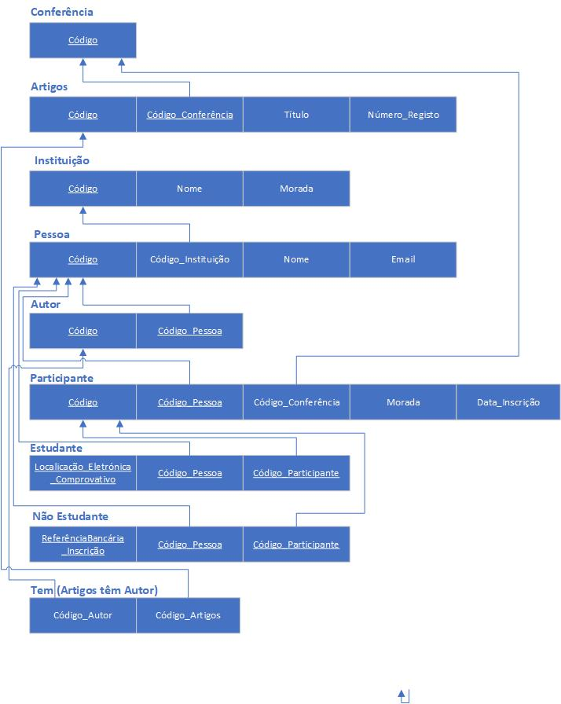
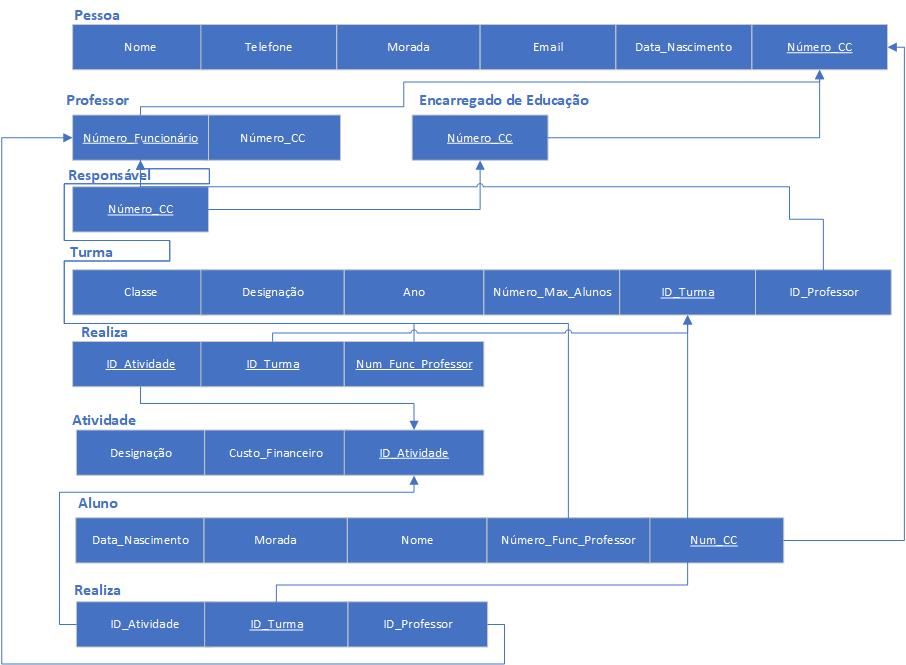

# BD: Guião 3


## ​Problema 3.1
 
### *a)*

```
Cliente{
    NIF:Integer
    nome:String
    endereço:String
    num_carta:Integer
}

Aluger{
    número:Integer
    duração:Integer
    data:Integer
}
Balcão{
    número:Integer
    endereço:String
    nome:String
}
Veículo{
    matrícula:Integer
    ano:Integer
    marca:String
}
Tipo_Veículo{
    código:Integer
    arcondicionado:Boolean
    designação:String
}
Ligeiro{
    numLugares:Integer
    portas:Integer
    combustivel:String
}
Pesado{
    peso:Integer
    pessageiros:Integer
}
```


### *b)* 

```
Cliente:    Pk -> NIF
            Ck(s) -> NIF , Num_carta
            Fk(s) -> None


Aluguer:    Pk -> Número
            Ck(s) -> Número
            Fk(s) -> None


Balcão:     Pk -> Número
            Ck(s) -> Número
            Fk(s) -> None


Veiculo:    Pk -> Matrícula
            Ck(s) -> Matrícula
            Fk(s) -> None


Tipo_Veiculo:    Pk -> Código
                 Ck(s) -> Código
                 Fk(s) -> None


Ligeiro:    Pk -> Código
            Ck(s) -> Código
            Fk(s) -> Código


Pesado:     Pk -> Código
            Ck(s) -> Código
            Fk(s) -> Código
```


### *c)* 




## ​Problema 3.2

### *a)*

```

Airport(
    Airport_code:Integer,
    City:String,
    State:String,
    Name:String
 );

 Airplane_Type(
    Type_name:String,
    Max_seats:Integer,
    Company:String
 );

 Airplane(
    Airplane_id:Integer,
    Total_no_of_seats:Integer,
    Airplane_Type_name:String
 );

 Flight(
    Flight_Number:Integer,
    Airline:String,
    Weekdays:String
 );

 Flight_Leg(
    Flight_Number:Integer,
    Leg_no:Integer,
    Departure_Airport_code:Integer,
    Arrival_Airport_code:Integer,
    Schedule_dep_time:String,
    Schedule_dep_time:String
 );

 Fare(
    Flight_Number:Integer,
    Code:Integer,
    Restrictions:String,
    Amount:Integer
 );

 Leg_Instance(
    Airplane_id:Integer,
    No_of_avail_seats:Integer,
    Date:String,
    Leg_no:Integer,
    Dep_time:String,
    Arr_time:String,
    Airport_code:Integer,
 );

 Seat(
    Airplane_id:Integer,
    Date:String,
    Seat_no:Integer,
    Costumer_Name:String,
    Cphone:Integer
 );

 Can_Land(
    Airport_code:Integer,
    Airplane_Type_Name:String
 );
```


### *b)* 

```
Airport:    Ck(s) -> Airport_code, Name
            Pk -> Airport_code
            Fk -> None


Airplane_Type:    Ck(s) -> Type_name
                  Pk -> Type_name
                  Fk -> None


Airplane:    Ck(s) -> Airplane_id
             Pk -> Airplane_id
             Fk -> Airplane_Type_name

             
Flight:    Ck(s) -> Flight_Number
           Pk -> Flight_Number
           Fk -> None

             
Fare:    Ck(s) -> Flight_Number, Code
         Pk -> Flight_Number, Code
         Fk -> Flight_Number

             
Flight_Leg:    Ck(s) ->Departure_Airport_code, Arrival_Airport_code, Flight_Number, Leg_no
               Pk -> Departure_Airport_code, Arrival_Airport_code, Flight_Number, Leg_no
               Fk -> Departure_Airport_code, Arrival_Airport_code, Flight_Number

             
Leg_Instance:    Ck(s) -> Airplane_id, Date
                 Pk -> Airplane_id, Date
                 Fk -> Airplane_id,Airport_code, Leg_no


Seat:    Ck(s) -> Airplane_id, Leg_Instance_Date,Seat_no
         Pk -> Airplane_id, Leg_Instance_Date, Seat_no
         Fk -> Airplane_id, Leg_Instance_Date


Can_Land:    Ck(s) -> Airport_code, Airplane_Type_name
             Pk -> Airport_code, Airplane_Type_name
             Fk -> Airport_code, Airplane_Type_name
```


### *c)* 




## ​Problema 3.3


### *a)* 2.1



### *b)* 2.2



### *c)* 2.3



### *d)* 2.4

